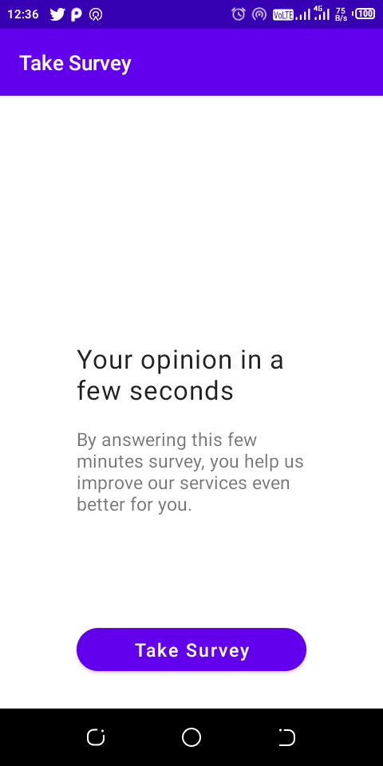
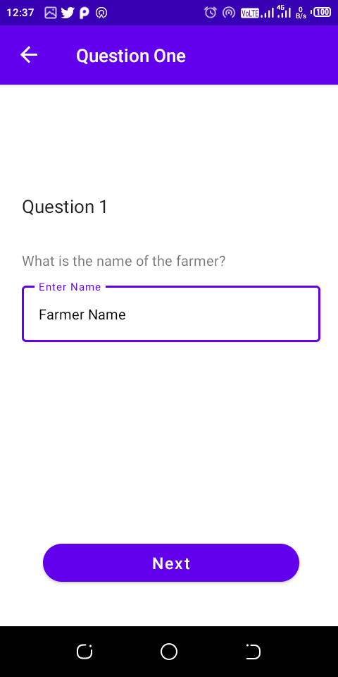
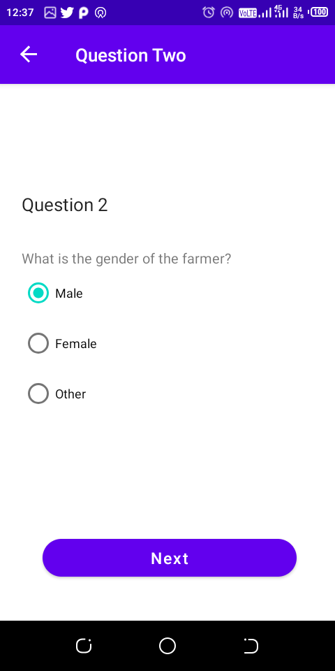
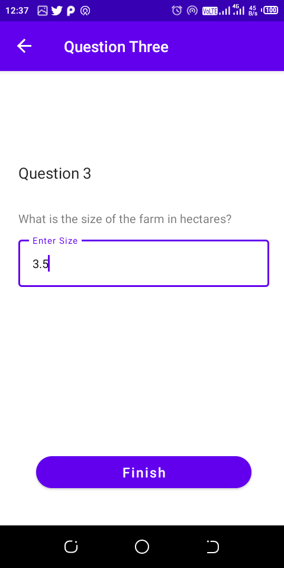

# FarmersSurveyApp
This app consumes from Survey JSON API endpoint to fetch survey JSON from the API and store it in the app DB. I did build the app to learn master more MVVM architecture and Repository Pattern, Restful web service, android background tasks and how to use shared viewmodel. I was practicing [Android Interviews: Take-home assessment tests questions](https://medium.com/@valentinerutto/android-interviews-take-home-assessment-tests-30223654c53a) by Valentine Rutto medium post. 

# Screenshots

|<strong>Start Survey </strong>|<strong>Question 1</strong>|
|:--:|:--:|
|||

|<strong>Question 2 </strong>|<strong>Question 3</strong>|
|:--:|:--:|
|||

# Libraries in use
- Retrofit - a type-safe HTTP Client for consuming RESTful API web services in android
- Gson - Kotlin/Java library for converting Kotlin/Java Objects into their JSON representation
- Navigation Components - Android Jetpack's component for implementing navigation for consistent and predictable user experience in android app
- WorkManager - Android library for implementing scheduling background tasks.
- ViewModel - responsible for preparing and managing the data for an Activity or a Fragment
- Room - Persistence library that provides app local data storage by providing abstract layer over the SQLite Database
- Coroutines - Kotlin features for executing synchronous and asynchronous task/code in android
